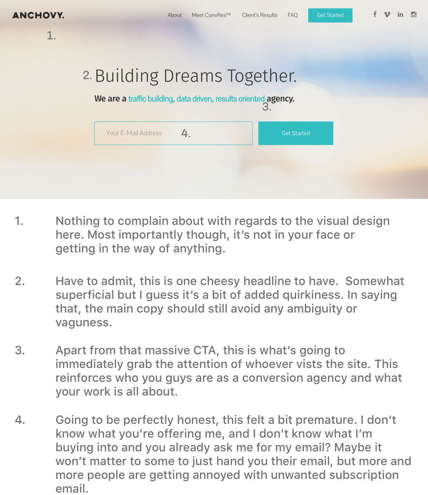

<h1 class="post-title" style="margin-bottom: 30px">Critiquing your soft-launched product</h1>

Hey Anchovy, so first off thanks for meeting with me. Really enjoyed talking process and data. You asked me to give a "small" critique on your recently redesigned website. I didn't have time to do the whole thing, so I just picked the homepage, which is most probably going to be the most obvious window of opportunity that'd you'd ideally like to capitalize on. Before you read on, here's a few words.

<article >

<h2>Disclaimer</h2>
    
Giving feedback <strong>without</strong> clearly getting to know the different constraints involved, the success criteria you were building & designing towards, the compromises that had to be made and of course, the long hours and late nights you spent on the product makes this critique slightly ill-informed and somewhat unsolicited.

 
That said, I'll do my best so as to not be biased and at the same time give you a primer on how I go about doing what I do best. So let's start shall we?

<h2>So who's this for?</h2>

So before diving into the product itself, I would imagine that the person that's looking for the kinds of services that you're offering, falls within the demographic of perhaps a <strong>business owner</strong> or a <strong>co-founder</strong> at a startup. Some might not even know that they may need to be wary of the different KPIs involved that's eventually going to decide whether they power on, or wither up and die.
 

I'm making the assumption that since the customers have found what you're offering, they're already educated about this. <i>However, it wouldn't be a bad idea to take an educational stance (maybe write some blog posts) and inform entrepreneurs, business owners and startups as to why they may need ANCHOVY's services in the near future.</i> 

<h2>One-line summary of what the product does</h2>

To be able to answer this, I need to be able to understand two things (i)what people want from your product, and (ii) how they will react to your product.

<h3>Before (Expectations)</h3>

Take the example of my father, whose a small business owner. His goal at the moment is to acquire more customers and reach a broader audience, through a well-thought out marketing strategy.
 

Searching for conversion experts probably isn't something he's going to do, what he will do though, is search for an <strong>'all-in-one' solution</strong> to get the metrics he wants. He wants someone to understand his vision, optimize the necessary channels and nurture his brand.

So let's breakdown what he wants. He's looking for (i)a plan to acquire more customers (ii)a cohesive branding strategy (iii) a manageable & credible framework that he can rely on to deliver. 

<h3>After (Reality)</h3>

Let's say he lands on your page. One thing we both know is that the onboarding process is the lifeblood of any product. First impressions are what's going to make or break that window of opportunity that you get, for a potential lead to convert. So let's dig in.

</article>

